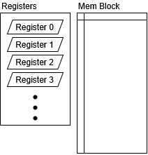

# HEE HOO VM

Very stupid, unenlightened, primitive machine. 

Bare essentials to be turing complete. Just some registers and a memory block.

## Install and Usage

| To Do | Command       |
| :---- | :------------ |
| Build | `cargo build` |
| Run   | `cargo run`   |

## System Architecture

16-bit architecture. Memory addressed by 9-bits (512 memory cells, each 16-bit words). Separate instruction memory addressed by 16-bit instruction pointer (65536 cells). 8 General Purpose Registers.

### Memory



### Instruction Set

**Instruction Layout**

```
Op   Arg 1  Arg 2
0000 000    000000000
```

| Instruction    | Opcode | Description                                                                                   |
| :------------- | :----- | :-------------------------------------------------------------------------------------------- |
| `HALT`         | `0000` | Stop execution of code                                                                        |
| `INIT reg val` | `0001` | Initialize register `reg` to value `val`                                                      |
| `LOAD reg adr` | `0010` | Load value in memory address `adr` to register `reg`                                          |
| `LDDY rA rB`   | `0011` | Load value from memory address in register `rB` to register `rA`                              |
| `SAVE reg adr` | `0100` | Save value in register `reg` to memory address `adr`                                          |
| `SVDY rA rB`   | `0101` | Save value in register `rB` to memory address in register `rA`                                |
| `MOVE rA rB`   | `0110` | Move value in register `rB` to register `rA` &dagger;                                         |
| `WRITE reg`    | `0111` | Output the value of register `reg` to the terminal                                            |
| `READ reg`     | `1000` | Read a value from the terminal into register `reg`                                            |
| `ADD rA rB`    | `1001` | Add value in register `rB` to value in register `rA`. Store result in `rA` &dagger;           |
| `AND rA rB`    | `1010` | Bitwise and value in register `rB` from value in register `rA`. Store result in `rA` &dagger; |
| `OR rA rB`     | `1011` | Bitwise or value in register `rB` from value in register `rA`. Store result in `rA` &dagger;  |
| `NOT reg`      | `1100` | Bitwise not value in register `reg` Store result in `reg`                                     |
| `JUMP adr`     | `1101` | Jump to instruction at `adr`                                                                  |
| `JPZR adr`     | `1110` | Jump to instruction at `adr` if last operation resulted in zero                               |
| `JPOV adr`     | `1111` | Jump to instruction at `adr` if last operation resulted in an overflow                        |

&dagger; Operation does not delete/overwrite value in other argument registers