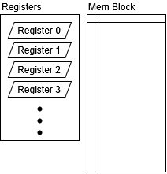

# HEE HOO VM

[hooooo](heeeeeeeeeeeeeeeeeeeee.png)

Very stupid, unenlightened, primitive machine.

Bare essentials to be turing complete. Just some registers and a memory block.

## Installation

Requires a Rust toolchain, 1.88 or newer (see [rustup.rs](https://rustup.rs)). Clone the repo, then build with Cargo:

```sh
git clone <repo-url> heehoo-vm
cd heehoo-vm
cargo build
```

## Usage

```sh
cargo run
```

### Binary file format

All multi-byte numbers are little-endian.

| Offset | Size (bytes) | Field                                       |
| :----- | :----------- | :------------------------------------------ |
| 0      | 10           | Magic text: ASCII `markiplier`              |
| 10     | 1            | Version number                              |
| 11     | 2            | Instruction section size, in bytes          |
| 13     | 2            | Data section size, in bytes                 |
| 15     | 2            | Start instruction pointer                   |
| 17     | _inst size_  | Instructions, one 16-bit word each          |
| ...    | _data size_  | Initial data memory (loaded from address 0) |

For example, a program that runs `INIT 0 10` then `HALT`:

```
6D 61 72 6B 69 70 6C 69 65 72   "markiplier"
00                              version 0
04 00                           4 bytes of instructions
00 00                           0 bytes of data
00 00                           start at instruction 0
0A 10                           0x100A = 0001 00 0000001010 = INIT 0 10
00 00                           0x0000 = 0000 00 0000000000 = HALT
```

## System Architecture

16-bit architecture. Memory addressed by 10-bits (1024 memory cells, each 16-bit words). Separate instruction memory addressed by 16-bit instruction pointer (65536 cells). 4 General Purpose Registers.

### Memory



### Instruction Set

**Instruction Layout**

```
Op   Arg 1  Arg 2
0000 00     0000000000
```

| Instruction    | Opcode | Description                                                                                   |
| :------------- | :----- | :-------------------------------------------------------------------------------------------- |
| `HALT`         | `0000` | Stop execution of code                                                                        |
| `INIT reg val` | `0001` | Initialize register `reg` to value `val`                                                      |
| `LOAD reg adr` | `0010` | Load value in memory address `adr` to register `reg`                                          |
| `SAVE reg adr` | `0011` | Save value in register `reg` to memory address `adr`                                          |
| `MOVE rA rB`   | `0100` | Move value in register `rB` to register `rA` &dagger;                                         |
| `WRITE reg`    | `0101` | Output the value of register `reg` to the terminal                                            |
| `READ reg`     | `0110` | Read a value from the terminal into register `reg`                                            |
| `ADD rA rB`    | `0111` | Add value in register `rB` to value in register `rA`. Store result in `rA` &dagger;           |
| `AND rA rB`    | `1000` | Bitwise and value in register `rB` from value in register `rA`. Store result in `rA` &dagger; |
| `OR rA rB`     | `1001` | Bitwise or value in register `rB` from value in register `rA`. Store result in `rA` &dagger;  |
| `NOT reg`      | `1010` | Bitwise not value in register `reg` Store result in `reg`                                     |
| `JUMP adr`     | `1011` | Jump to instruction at `adr`                                                                  |
| `JPZR adr`     | `1100` | Jump to instruction at `adr` if last operation resulted in zero                               |
| `JPOV adr`     | `1101` | Jump to instruction at `adr` if last operation resulted in an overflow                        |

&dagger; Operation does not delete/overwrite value in other argument registers
